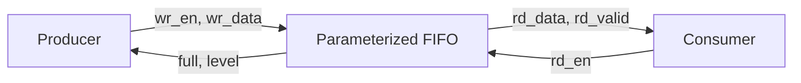
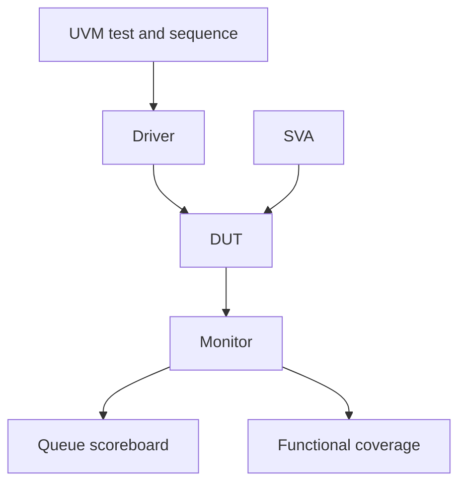

# Synchronous FIFO — RTL and UVM Verification

A parameterized, synthesizable synchronous FIFO with a self-checking UVM 1.2 environment, SystemVerilog assertions, functional coverage, and an independently runnable Verilator smoke test.

## Why this project matters

FIFOs decouple producers and consumers while preserving transaction order. This project focuses on the boundary behavior that commonly causes silicon bugs: pointer wraparound, overflow/underflow protection, and simultaneous read/write operations at full and empty.

## Architecture



The DUT uses binary read/write pointers with an additional wrap bit. Equal complete pointers indicate empty. Equal address bits with different wrap bits indicate full. See [the detailed specification](docs/specification.md).

## Verification environment



The scoreboard models accepted traffic with a SystemVerilog queue and checks every returned word and occupancy update. Coverage crosses operations with boundary status. Assertions verify flag exclusivity, legal occupancy, and blocked underflow. The complete plan is in [docs/verification_plan.md](docs/verification_plan.md).

## Run with Cadence Xcelium

Prerequisites: Cadence Xcelium with UVM support and GNU Make.

```bash
make uvm
make regress
```

Useful overrides:

```bash
make uvm TEST=fifo_base_test SEED=123 UVM_VERBOSITY=UVM_HIGH
```

Expected summary includes:

```text
UVM_INFO ... [FIFO_SUMMARY] Checked <N> writes and <N> reads
UVM_ERROR : 0
UVM_FATAL : 0
```

## Open-source RTL smoke test

Install Verilator 5.x and run:

```bash
make smoke
```

The smoke binary runs the FIFO SVA as well as data checks. Success is explicit:

```text
SYNC_FIFO_SMOKE_PASS checks=11
```

See [verified results and tool scope](docs/verification_results.md) for the reproducible validation record.

## Repository map

- `rtl/` — synthesizable FIFO
- `tb/interfaces/` — pin-level verification interface
- `tb/pkg/` — transaction, agent, sequences, scoreboard, coverage, environment, and test
- `tb/assertions/` — protocol-independent FIFO properties
- `tb/smoke/` — small self-checking test used for portable execution
- `docs/` — specification and coverage-driven verification plan
- `sim/files.f` — Xcelium compilation order

## Engineering notes

- The FIFO is intentionally restricted to power-of-two depth; this keeps wrap-bit full detection mathematically correct.
- Empty simultaneous read/write does not bypass incoming data. The write is accepted and the read must be retried.
- Full simultaneous read/write accepts both operations, keeping occupancy at `DEPTH`.

## License

MIT — see [LICENSE](LICENSE).
